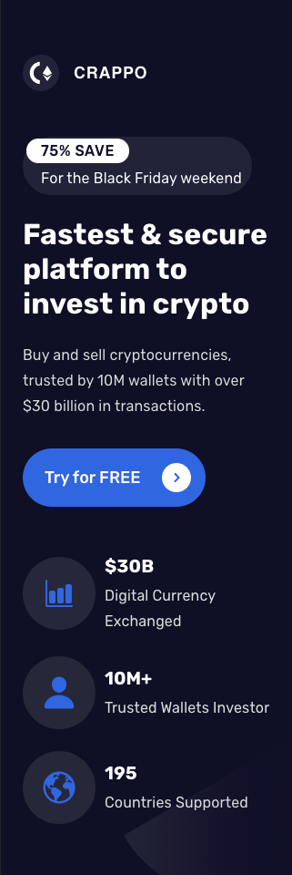
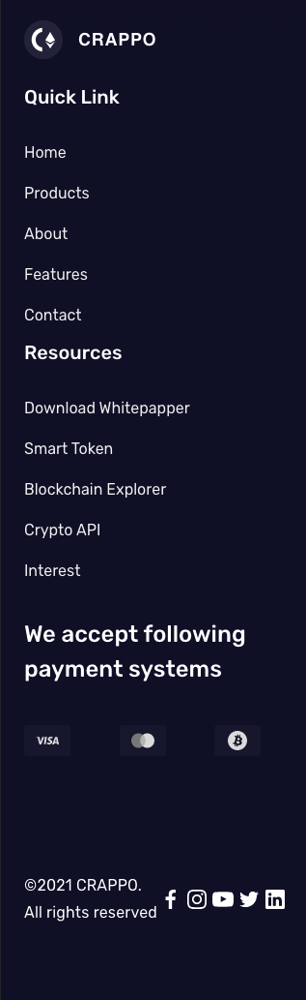

# CRAPPO CRYPTOCURRENCIES

> A simple landing page for your crypto currencies.

<p align="center">
  👀 &nbsp;
  <a href="https://crappo-crypto-cnkhm098o-geminii.vercel.app/" target="_blank">Demo</a> | 🐦 &nbsp; 
  <a href="https://www.figmacrush.com/crypto-landing-template-for-figma/">Design Inspiration</a>
</p>
<p align="center">
  
  
  
</p>

<div align="center">
  
</div>

<div align="center" style="margin-top: 2rem;">
  
  
</div>

## Getting started

```bash
# install dependencies
$ yarn install

# serve with hot reload at localhost:1234
$ yarn dev

# build to deploy app
$ yarn build
```

## Conventional Commits

[Conventional Commits](https://www.conventionalcommits.org) is a specification for adding human and machine readable meaning to commit messages shared by a large community of developers.

## Contributing

If you want to contribute on this project, it will a great pleasure 🚀 Don't hesitate to create a pull request 🤩

All contributions are welcome to improve the user experience and to learn new things about frontend languages 💖

# License

[MIT License](./LICENSE)
